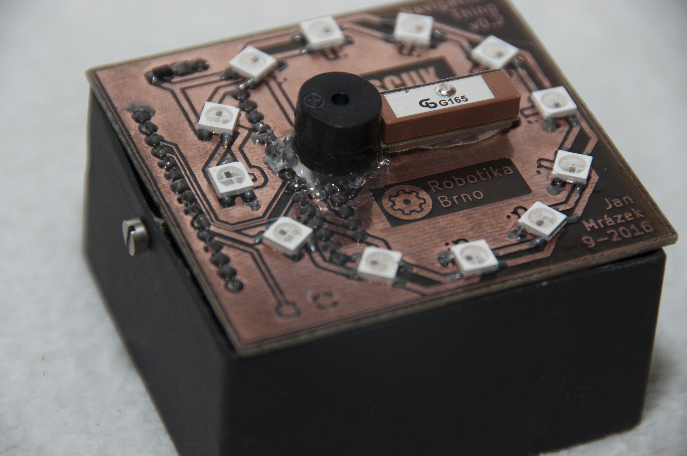
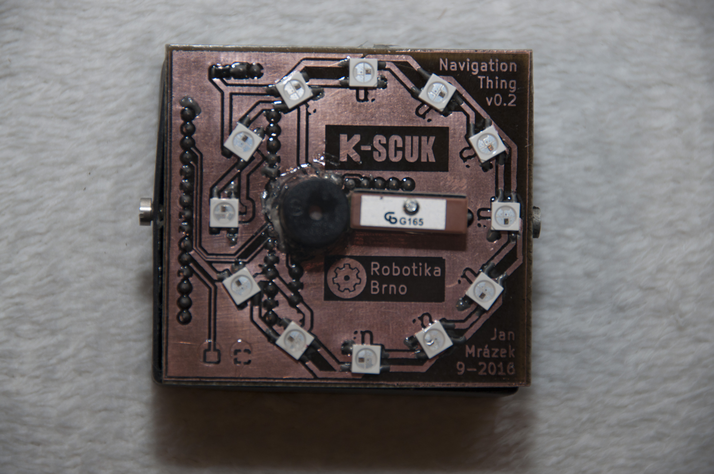

# NavigationThing

The thing, which will safely guide you through darkness. A prop used during
[K-SCUK 2016](http://kscuk.fi.muni.cz/) night game.

# What does it do?

NavigationThing features an electronic compass and a GPS receiver, which are
used for navigation of a user through a series of waypoints. Distance to the
next waypoint is indicated via beeping, which adds a mysterious feeling. Closer
the user is, the faster the box beeps. NavigationThing is powered by 4 AA
batteries.

# How to use it?

The navigation thing is ready out of box. When you power it for the first time,
the unit beeps, goes black for 3 seconds and then the unit enters compass
calibration mode, which is indited via purple flashing. **It is necessary to
rotate the unit on a flat surface until it stops flashing.** After initial setup,
the unit starts normal operation.

During normal operation, the thing shows either electronic compass or flashes
red. Red flashing indicates missing GPS fix. The thing remembers progress in
EEPROM, so user can safely remove batteries in the middle of operation and
insert them back again. To reset the unit, simply short two pads in the left-
bottom corner of PCB during power-up. Then restart the unit.

To change waypoints, change `waypoints` array in the firmware source code. When
user enters a waypoint, an user supplied callback function is called.

# Repository Structure

The repository is organized as follow:

- `NavigationThing` contains the unit's firmware. The firmware is written in
  Arduino to keep things simple.

- `NavigationThingHwTest` contains testing firmware, which tests the PCB - LEDs
  and peripherals communication.

- `hw` contains schematics and PCBs in KiCAD

I am sorry, there are no CAD files for the box.
